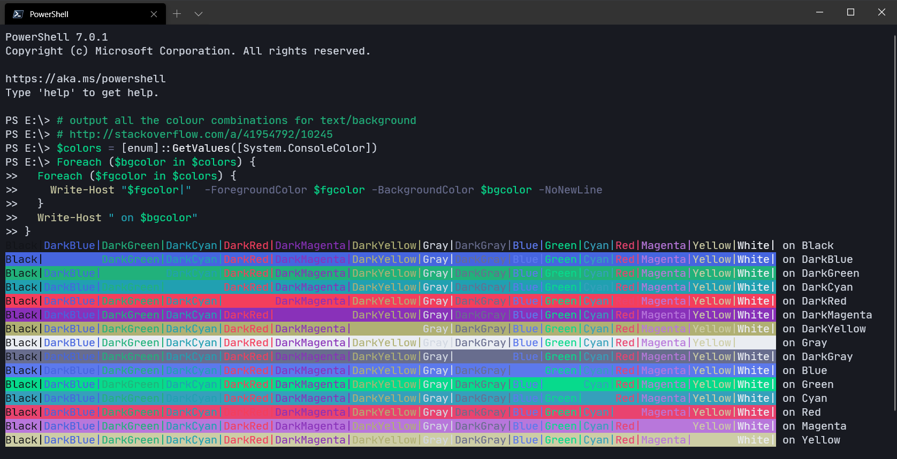
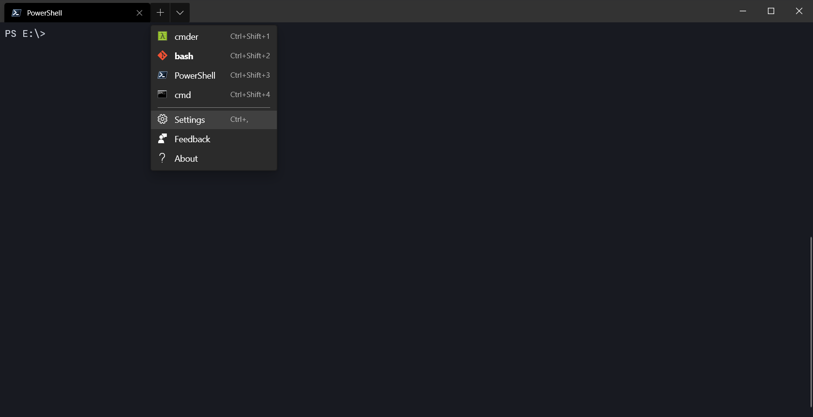
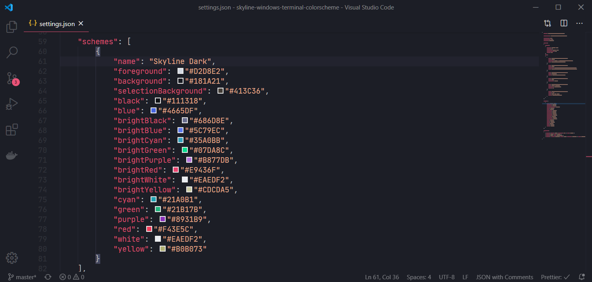

# Skyline Windows Terminal ColorScheme

A vibrant color scheme for Windows Terminal



## Usage

Open `settings.json` and copy the scheme from [`schemes.json`](./schemes.json).





To use for all profiles, specify `colorScheme` for the `defaults` object.

```json
{
  "profiles":
  {
    "defaults":
    {
      "colorScheme": "Skyline Dark",
    },
  }
}
```

To use with a specific profile, specify `colorScheme` for the profile in the `list` array.

```json
{
  "profiles":
  {
    "list":
    [
      {
        "guid": "{574e775e-4f2a-5b96-ac1e-a2962a402336}",
        "name": "PowerShell",
        "source": "Windows.Terminal.PowershellCore",
        "colorScheme": "Skyline Dark"
      },
    ]
  }
}
```

## License

[MIT](./LICENSE.md)
